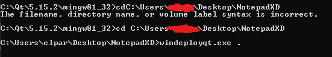

## NotepadXD

This is a normal notepad! :D

If u want 2 compile the program, u need Qt 5.15.2 and MinGW 8.1.0

2 compile the project, u need 2 put these commands:

```
cd C:\directory\2\executable (u need 2 put the directory of the executable)
windeployqt.exe .
```

Something like this:


